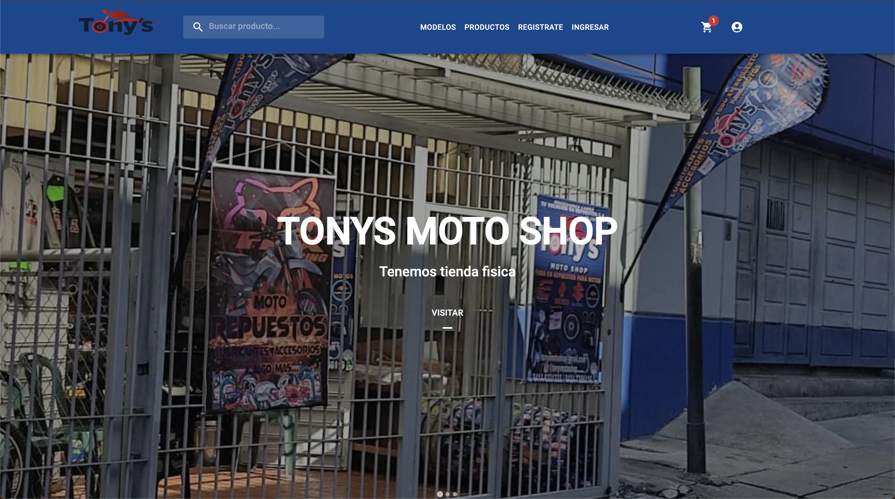
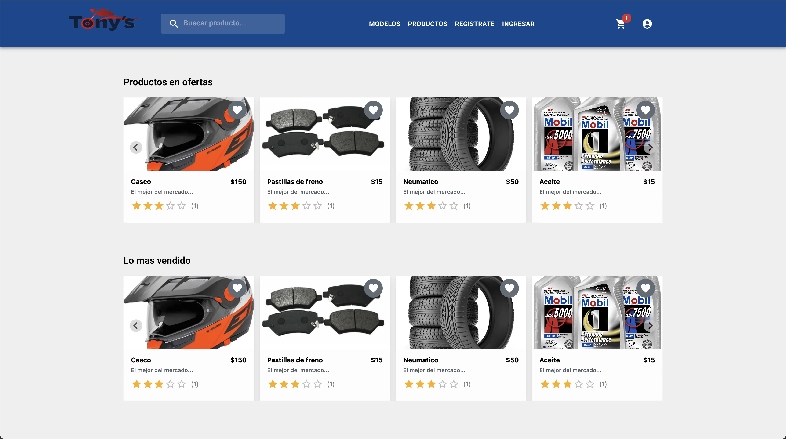
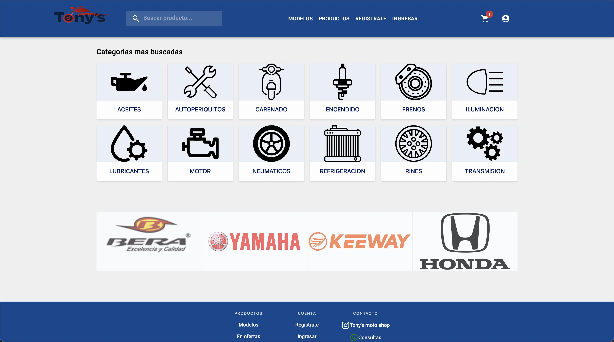

# Tony's Moto Shop

Tony's Moto Shop is an e-commerce page about motorcycle parts and gadgets, where the user can explore the page and see all the available products until he get the one he need, add it to the cart and finally pay for it.

## UI

Built with React js, react-dom, mui-material, mui/icons-material, reduxjs/toolkit, react-redux, splidejs/react-splide, axios, lodash, webpack, react-app-alias, react-app-rewired, sass.
